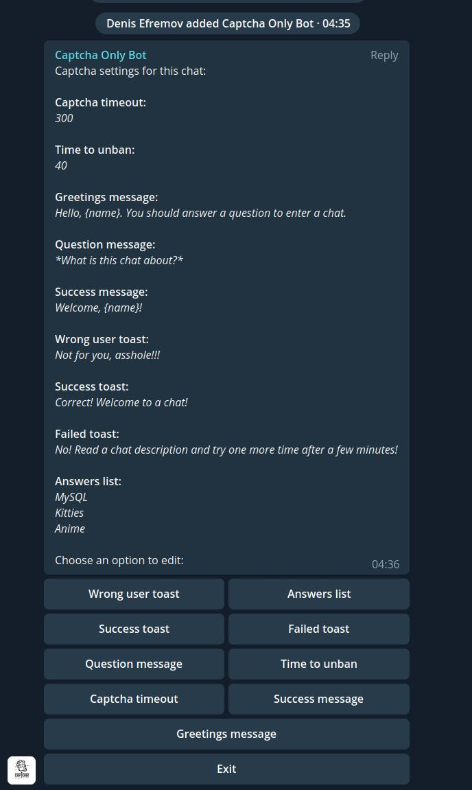

# Captcha Only Bot

Captcha admin bot.

> **!!! Bot requires admin rights and looses its sense either!**

## Overview

Each newcomer to a chat will be instantly restricted to do anything in a chat, until he choose a correct answer to a question. A question and an answer options may be edited. Options are placed on inline keyboard buttons.

## Commands

- **`/settings`** - _Works only in groups and only for admins!!!_ Shows the settings overview and editor.

## Donate

- **BTC** `3F275vPSCvYW19MHZqSjw79fEwwU4MbTgV`
- **LTC** `MGMCQB3QAcrSBjU3eGJviqB2J2f5BNVRGr`
- **DOGE** `D5m69FRDGEn3G3xuakvqTxUpGVt6NegKJp`
